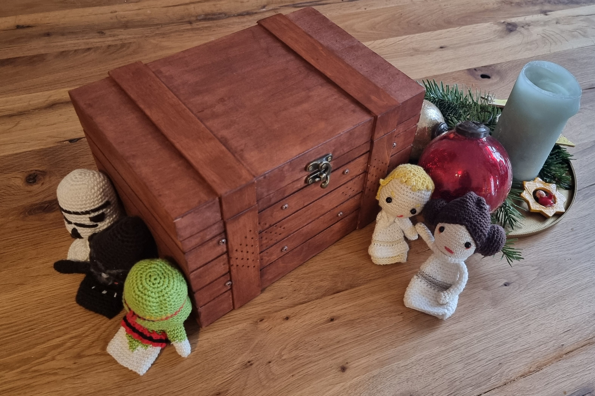

# Phoniebox

This repo is my personal configuration of the [Phoniebox Project](https://phoniebox.de/)
The target of this repo is to do a reproducable installation of the box including all docs of my build.

Thanks a lot on the Open Source Team (a lot of dad's and weekend coders) of the Phoniebox! Another big thank you for the infos described in his [blog](https://splittscheid.de/phoniebox-bauanleitung-toniebox-alternative/) building its own box is [splitti](https://github.com/splitti/)

<video width="720" height="480" controls>
  <source src="./doc/phoniebox.mp4" type="video/mp4">
</video>

## My Hardware:
- [Raspberry Pi 4 (8GB Ram)](https://geizhals.de/raspberry-pi-4-modell-b-v54547.html)
- [1TB SanDisc Extreme Portable SSD](https://geizhals.de/sandisk-extreme-1050mb-s-portable-ssd-1tb-sdssde61-1t00-g25-a2374502.html)
- [Hifiberry Miniamp](https://geizhals.de/hifiberry-miniamp-a2403639.html)
- [3 Buttons 22mm](https://geizhals.de/3422565781)
- [1 Push Button 12mm](https://www.amazon.de/gp/product/B0C135W52J/ref=ppx_yo_dt_b_asin_title_o03_s00?ie=UTF8&psc=1)
- [Neuftech USB RFID Card Reader](https://geizhals.de/rfid-nfc-modul-em4100-verschiedene-hersteller-a1520356.html)
- [2 Boxes](https://geizhals.de/visaton-frs-8-8-ohm-2004-a2855789.html)
- [GPIO Extension Board](https://geizhals.de/1940125090)
- [Extertnal Charging cabel](https://geizhals.de/2223961498)
- [PowerBank](https://geizhals.de/3502046731)

## My Software
- Raspberry Pi OS Lite (32-bit) | Bookworm
- Phoniebox future3 v3.3
- Configs and OS Tunings are inside this repo!

## Installation
1. Build a 32-bit! Raspberry Pi OS Lite using [Raspberry Pi Imager](https://www.raspberrypi.com/software/). **Set Wifi/Host Settings to make your life easyer**
2. Run the bash scripts in this repo one by one starting from 0
3. done!

## Music
This repo contains a [downloader app](./downloader). Fill the [youtube.csv](./downloader/youtube.csv) run the appplication to get the music you want to listen on the phoniebox, downloaded and prepared in folders.

Some notes during my process: [here](./NOTES.md)

## RPI Boot Optimization

After a clean installation of Raspberry OS and the Phoniebox I had a boot time of **43 Seconds**. I spend some time on reading and optimizing...here is what I did:

- [x] [/boot/config.txt](./pi/config.txt)
- [x] [/boot/cmdline.txt](./pi/cmdline.txt)
- [x] set static ip
- [x] disable boot partition (`sudo nano /etc/fstab`)
- [x] raspberrypi Firmwareupdate (run: `sudo rpi-update`)
- [x] disabled services ([3-optimize-boot.sh](./3-optimize-boot.sh))

## Sources

- [Optimize Boot | raspberry-pi-geek.de](https://www.raspberry-pi-geek.de/ausgaben/rpg/2020/06/die-boot-zeit-von-raspbian-optimieren/2/)
- [Optimize Boot | singleboardbytes.com](https://singleboardbytes.com/637/how-to-fast-boot-raspberry-pi.htm)